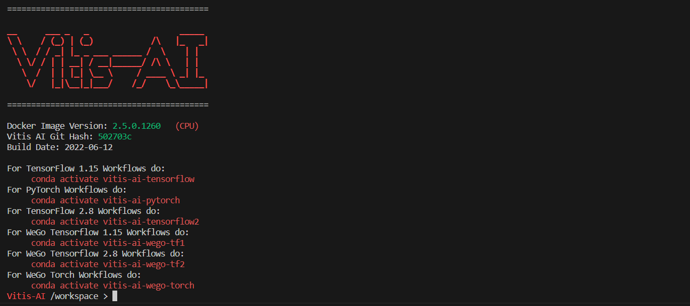

# Vitis AI 实验: MNIST分类器

## 安装 Vitis AI
1. 安装 docker
    * 官网: [https://docs.docker.com/engine/install/](https://docs.docker.com/engine/install/)
    * Ubuntu安装: [https://docs.docker.com/engine/install/ubuntu/](https://docs.docker.com/engine/install/ubuntu/)
1. 下载 Vitis-AI 2.5 的 docker 镜像
    ```
    sudo docker pull xilinx/vitis-ai:2.5
    ```
1. 克隆 Vitis-AI 的 GitHub 仓库
    ```shell
    git clone https://github.com/Xilinx/Vitis-AI.git -b v2.5
    ```

1. 克隆本仓库到 `Vitis-AI` 目录
    ```shell
    cd Vitis-AI
    ```
    ```shell
    git clone https://github.com/qixingzhang/SummerSchool-Vitis-AI.git
    ```
1. 启动 Vitis AI
    ```shell
    sudo ./docker_run.sh xilinx/vitis-ai:2.5
    ```
    按照提示查看并同意License, 成功启动会看到下面的输出
    <p align="center">
    
    </p>
    <p align = "center">
    </p>

## 使用 Vitis AI
1. 激活 TensorFlow 2.x 的环境
    ```shell
    conda activate vitis-ai-tensorflow2
    ```
1. （可选）训练模型
    > `float_model.h5` 是一个训练好的模型，你也可以选择自己训练
    ```shell
    cd SummerSchool-Vitis-AI
    ```
    ```shell
    python train.py
    ```
1. 量化
    ```shell
    ./1_quantize.sh
    ```

    脚本中调用了 `vitis_ai_tf2_quantize.py`, 使用 python 的 API 进行量化:
    * 首先加载模型并创建量化器对象
        ```python
        float_model = tf.keras.models.load_model(args.model)
	    quantizer = vitis_quantize.VitisQuantizer(float_model)
        ```
    * 加载数据集用于模型校准 (Calibration)
        ```python
        (train_img, train_label), (test_img, test_label) = mnist.load_data()
	    test_img = test_img.reshape(-1, 28, 28, 1) / 255
        ```
    * 量化模型, 需指定用作校准的数据集（`calib_dataset`参数）, 可以使用部分的训练集或测试集，通常100 ~ 1000个就够了
        ```python
        quantized_model = quantizer.quantize_model(calib_dataset=test_img)
        ```
    * 量化完之后模型依旧被保存为 `.h5` 格式
        ```python
        quantized_model.save(os.path.join(args.output, args.name+'.h5'))
        ```
1. 编译
    ```shell
    ./2_compile.sh
    ```
    脚本使用 `vai_c_tensorflow2` 命令进行模型的编译, 需指定以下参数:
    * `--model` 量化之后的模型
    * `--arch` 指定DPU架构，每个板卡都不一样, 可以在 `/opt/vitis_ai/compiler/arch/DPUCZDX8G` 目录下寻找
    * `--output_dir` 输出目录
    * `--net_name` 模型的名字

    输出的 `.xmodel` 文件被保存在`compile_output` 目录下

## 使用 DPU-PYNQ 部署模型
1. 使用 PYNQ 2.7 或 3.0.1 版本的镜像启动板卡
    * 镜像下载链接: [http://www.pynq.io/board.html](http://www.pynq.io/board.html)
1. 在板卡上安装 pynq-dpu
    ```shell
    $ sudo pip3 install pynq-dpu --no-build-isolation
    ```
1. 将 `notebooks/dpu_mnist_classifier.ipynb` 和 `compile_output/dpu_mnist_classifier.xmodel` 上传到 jupyter 中，运行notebook


